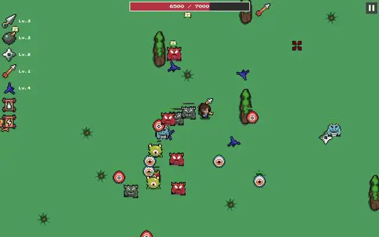

# Mobhold

Survive endless spiky hordes with your maxed-out pixel legion! Cluster, level up, and hold the line.
A retro pixel-art auto-battler survival game. Command your growing horde of ninjas against waves of monstrous foes. Form tight defensive clusters, upgrade your units, and push the population limit to endure the onslaught!

Tech Stack: HTML5 Canvas + vanilla JavaScript

# 💫 Our Mission
Digital wealth for everyone by open source. Fantastic games without micro transactions, ads and telemetry. Fund the mission for a better tomorrow:
Support on Patreon https://www.patreon.com/c/agentratelimit/membership

# 🏆 Credits

Assets: Ninja Adventure Asset Pack by pixel-boy (CC0 - free for any use, attribution appreciated!)

Cursors: https://wenrexa.itch.io/cursors-pack-03

Character and background: https://game-endeavor.itch.io/mystic-woods

Pixel art: https://bigwander.itch.io/

# 📄 License
MIT License - See LICENSE for details.

# 🤝 Contribute

Found a bug? Open an issue.
Want to add features? Fork and PR!
Star the repo to show support. ⭐